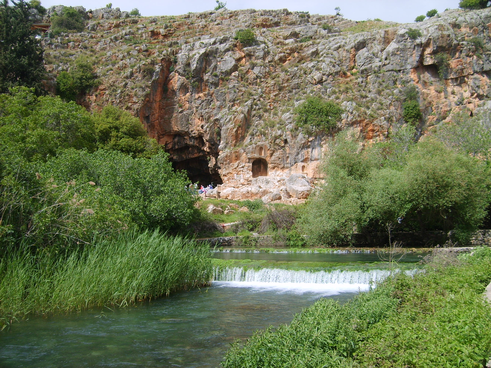

# Hello World

Hello world. This is a report.

## Some entry

| Right | Left | Default | Center |
|------:|:-----|---------|:------:|
|   12  |  12  |    12   |    12  |
|  123  |  123 |   123   |   123  |
|    1  |    1 |     1   |     1  |

  : Demonstration of pipe table syntax.

## Sample Figure

This is a figure of Banias Spring, using pandoc's `implicit_figures` extension.

Some text after the figure.
